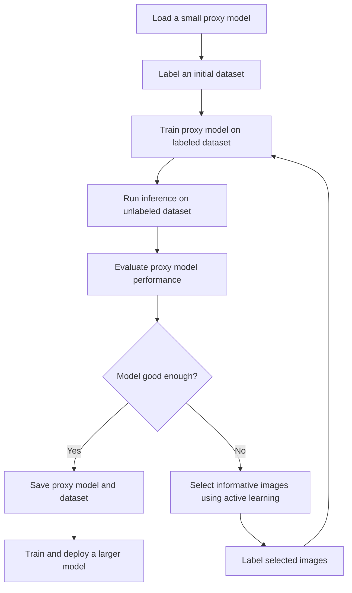
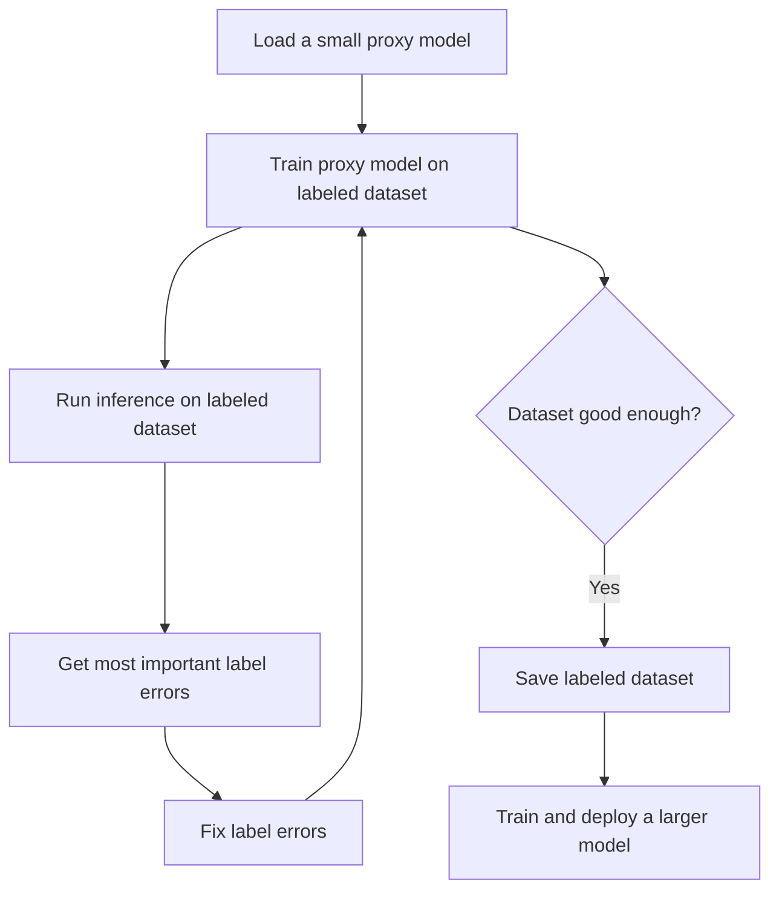

# active-learning-flywheel
Active learning at the edge for computer vision.

The goal of this project is to create a framework for active learning at the edge for computer vision. We should be able to train a model on a small dataset and then use active learning to iteratively improve the model all on a local machine.

## Tech Stack

- Training framework: fastai
- User interface: streamlit
- Database: sqlite
- Experiment tracking: wandb

## Workflow

### With unlabeled data
If we have no labeled data, we can use active learning to iteratively improve the model and build a labeled dataset.

1. Load a small proxy model.
2. Label an initial dataset.
3. Train the proxy model on the labeled dataset.
4. Run inference on the unlabeled dataset.
5. Evaluate the performance of the proxy model on the unlabeled dataset.
6. Is model good enough?    
    - Yes: Save the proxy model and the dataset.
    - No: Select the most informative images to label using active learning.
7. Label the most informative images and add them to the dataset.
8. Repeat steps 3-6.
9. Save the proxy model and the dataset.
10. Train a larger model on the saved dataset.

    
### With labeled data
If we have a labeled dataset, we can use active learning to iteratively improve the dataset and the model by fixing the most important label errors.

1. Load a small proxy model.
2. Train the proxy model on the labeled dataset.
3. Run inference on the entire labeled dataset.
4. Get the most important label errors with active learning.
5. Fix the label errors.
6. Repeat steps 2-5 until the dataset is good enough.
7. Save the labeled dataset.
8. Train a larger model on the saved labeled dataset.

