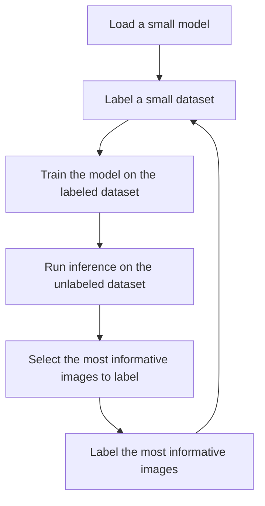

# active-learning-flywheel
Active learning at the edge for computer vision.

The goal of this project is to create a framework for active learning at the edge for computer vision. We should be able to train a model on a small dataset and then use active learning to iteratively improve the model all on a local machine.

## Tech Stack

- Training framework: fastai
- User interface: streamlit
- Database: sqlite
- Experiment tracking: wandb

## Workflow

1. Load a small model.
2. Label a small dataset.
3. Train the model on the labeled dataset.
4. Run inference on the unlabeled dataset.
5. Select the most informative images to label using active learning.
6. Label the most informative images and add them to the dataset.
7. Repeat steps 3-6 until the model is good enough or we run out of resources.
8. Save the model and the dataset.
9. Train a larger model on the saved dataset.

    